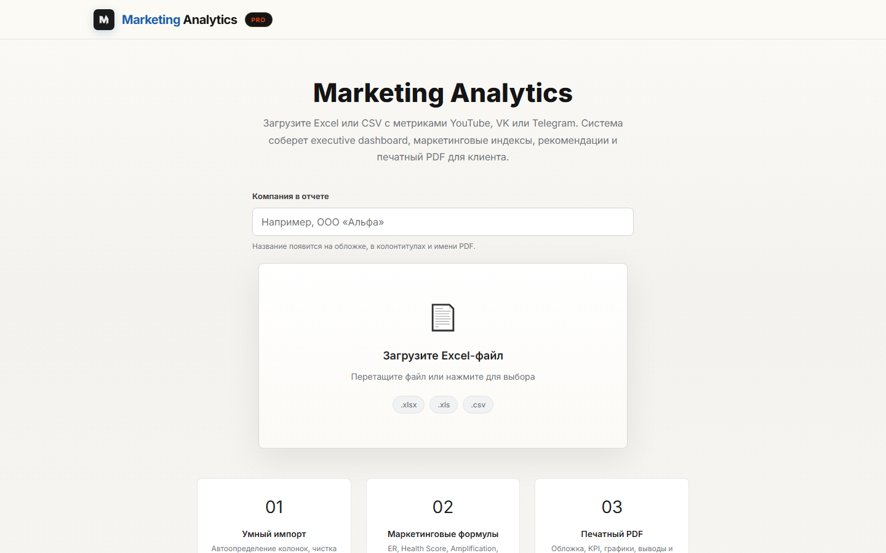
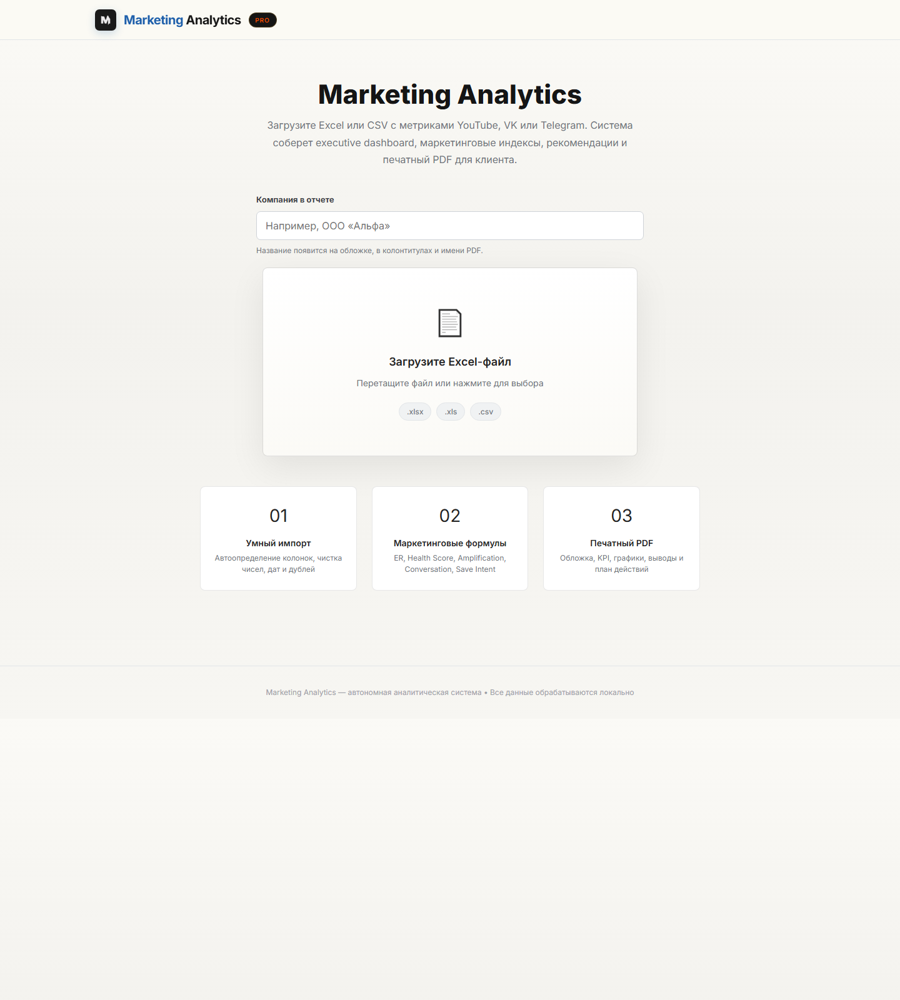

# Marketing Analytics

**Локальное Windows-приложение для анализа маркетинговых выгрузок и подготовки презентационных PDF-отчётов.**

Marketing Analytics превращает сырые выгрузки социальных платформ в понятный управленческий отчёт: динамика показателей, бенчмарки, сравнение периодов, рекомендации и PDF для клиента.



## Что делает приложение

- Принимает `.xlsx`, `.xls` и `.csv` без жёсткого шаблона.
- Определяет доступные метрики и не создаёт KPI, если исходные данные их не подтверждают.
- Считает ER, охват, частоту, вовлечённость, динамику, вклад платформ и маркетинговые индексы там, где данные это позволяют.
- Сравнивает периоды: месяц к месяцу, квартал к кварталу, рост, просадку и причины изменений.
- Сопоставляет показатели с бенчмарками платформ и ниш.
- Формирует рекомендации и премиальный PDF для печати.
- Позволяет указать название компании для каждого отчёта: приложение не привязано к одному бренду.
- Работает локально: исходные файлы, графики и отчёты остаются на компьютере пользователя.

## Как это работает



1. Укажите название компании для отчёта.
2. Перетащите выгрузку YouTube, VK, Telegram или другой маркетинговой платформы.
3. Проверьте распознанные метрики, бенчмарки, сравнение периодов, графики и рекомендации.
4. Скачайте брендированный PDF-отчёт.

## Установка готовой версии

Скачайте `MarketingAnalytics-win-x64.zip` из актуального GitHub Release, распакуйте архив и запустите:

```text
MarketingAnalytics.exe
```

Это автономная сборка для Windows x64. Пользователю не нужно устанавливать Python, Node.js, .NET или WebView2: все компоненты уже включены в пакет. После распаковки приложение работает без интернета.

## Возможности

| Блок | Что входит |
| --- | --- |
| Умный импорт | Распознавание колонок, очистка чисел, дат и дублей, XLS/XLSX/CSV |
| Маркетинговый анализ | KPI, вовлечённость, охват, частота, вклад площадок |
| Сравнение периодов | Динамика и объяснение ключевых изменений |
| Бенчмарки | Интерпретация ER, охвата и частоты с учётом платформы и ниши |
| Контроль качества | Профиль надёжности и защита от некорректной статистики |
| Отчётность | Брендированный PDF с графиками, выводами и планом действий |

## Сборка из исходников

Сборка выполняется на Windows x64:

```powershell
python -m pip install -r backend\requirements.txt
cd frontend; npm.cmd ci; cd ..
powershell -ExecutionPolicy Bypass -File scripts\publish-desktop.ps1
```

Для компьютера разработчика нужны Python 3.12, Node.js 20+ и .NET SDK 9. Скрипт упаковки добавляет все runtime-компоненты в финальную версию и при первой сборке скачивает официальный Microsoft WebView2 Fixed Version Runtime.

Результат:

```text
dist\MarketingAnalytics\MarketingAnalytics.exe
```

## Структура проекта

```text
backend/            Аналитика, рекомендации, бенчмарки, графики и PDF
frontend/           Интерфейс Next.js
desktop-webview2/   Нативный WPF-лаунчер и управление локальными процессами
scripts/            Воспроизводимая сборка
installer/          Определения установщика Windows
```

## Конфиденциальность

Marketing Analytics запускает внутренние сервисы только на `127.0.0.1`. Исходные файлы, сгенерированные графики и PDF сохраняются локально и не отправляются приложением во внешние сервисы.

## Автоматизация релизов

Тег версии, например `v1.0.0`, запускает GitHub Actions. Workflow собирает Windows-пакет и прикладывает `MarketingAnalytics-win-x64.zip` как артефакт сборки.
